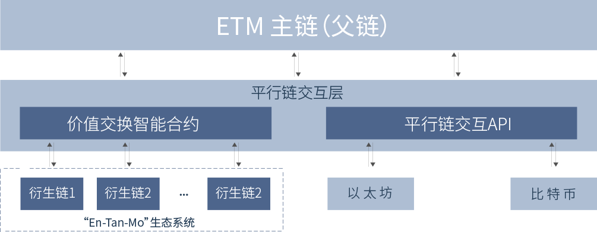

[English](./README.md) | 简体中文

<h1 align="center">En-Tan-Mo</h1>

   

En-Tan-Mo， 灵感来源于 Entente（联盟）、Transaction（交易）和 Mobius（莫比乌斯），是基于纳什均衡和价值传递理论的新一代区块链项目。

诺贝尔经济学奖得主、理性预期学派领袖**托马斯·萨金特**教授，诺贝尔物理学奖得主、大一统理论奠基人**谢尔顿·格拉肖**教授以及来自于美国加州理工大学、美国马里兰大学、法国庞加莱研究所的各领域学者们，将博弈论的研究成果革命性融入区块链中，共同创造了具有 SHD 完备性的 En-TanMo。在 En-Tan-Mo 世界中，SCV 矿工和 Pareto 矿池，在 Kantorovich 共识机制下相互支撑、相互激励，包容各种区块链与非区块链的应用和社区，帮助所有渴望公平、民主、自由的人们，在区块链带来的去中心化思潮中，均衡的获得属于每个个体的最高权益。En-Tan-Mo，不仅仅是一个纳什均衡的区块链底层平台，还包含了最丰富的应用和最广泛的社区，甚至包含了严谨的数学论证和丰富的经济学内涵，从而形成了完整的哲学思想和系统。因此，“技术白皮书”的形式难以体现出 En-Tan-Mo 的真正优势，研发团队以资料汇编的形式从世界、哲学、数学、经济、计算、生态等多维度向每一个关注 En-Tan-Mo 的人进行阐述。

- 官网: https://www.entanmo.com

## 主链与侧链简介

主链与侧链结构又称之为中心链与衍生链结构

在区块链所面临的多问题中,区块链之间互通性极大程度的限制了区块链的应用空间不论对于公有链还是私有链来看,跨链技术就是实现价值传递的关键，将区块链从分散的孤岛中拯救出来,是区块链向外拓展和连接的桥梁。现有的跨链技术主要以侧链为主,但其实际上实现的仅仅只是价值锁定,而不是价值传递。为此,“En-Tan-Mo”经过对现有跨链技术的研究,提出了一种平行链交互协议,很好的实现了链与链之间的价值传递,从而构建了一个可以包含千万级应用的区块链生态系统。
为了解决区块链快速和区块链即服务(BaaS)的问题,“En-Tan-Mo”采用了一条中心链加多条衍生链的设计,中心链负责网络安全及价值交换。衍生链是一种特殊的区块链,每一个衍生链对应一个DAPP,是一个独立的、隔离的系统,通过继承和复用主链强大的区块技术,每个应用都拥有一套个性化的账本,拥有自己的代币,其共识机制、区块参数、交易类型都是可以被定制的。各衍生链之间具有平行关系,即衍生链与衍生链之间互为平行链。它们可以通过中心链的“平行链交互层”实现其与中心链、其他衍生链及外部区块链链之间的双向资产传递,这使得用户能用已有的资产来使用“En-Tan-Mo”系统。

以下是链结构：

  

#### 多链结构优势
1. 合作共赢关系
  对比与大多数公链，使用为什么昂贵，效率低，其最本质的特点就是资源竞争问题；entanmo独创的多链结构，一个Dapp运行在一个单独的侧链上，那么他们的资源是不受其他链影响的。
2. 私人定制
  由于entanmo的Dapp是运行在单独的侧链上，不受其他链影响，那么在可控范围内，entanmo给予了侧链足够高的定制性，比如genesis.json中的相关参数。
3. 高并发、安全、易开发
  这些基本属性稍后会在侧链章节仔细讲解。
 
 ## 文档指南
 - [开发准备](./md/before_dev.md)
 - [合约开发](./md/smart_contract.md)
 - [合约SDK](./md/smart_contract_api.md)
 - [远程接口](./md/http_api.md)
 - [案例](./md/demo.md)
 - [日志](./md/log.md)
 - [问答](./md/QA.md)
 - [TODO](./md/TODO.md)

