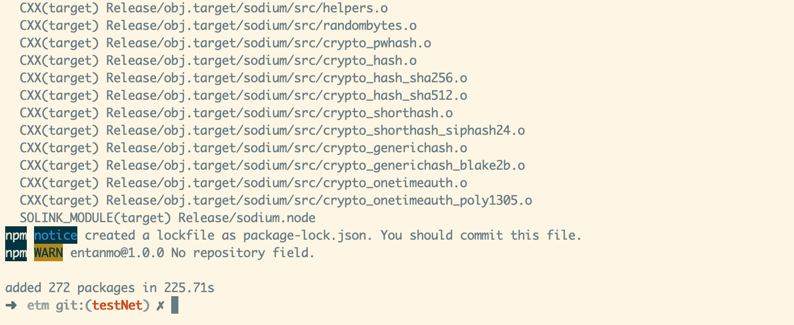
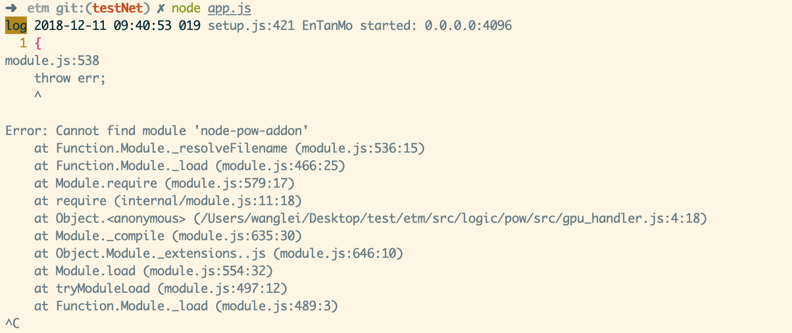
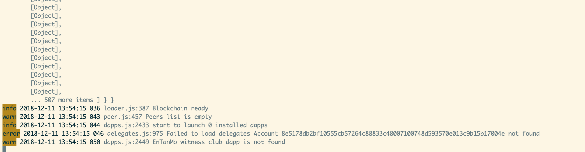

## 开发准备
### 1.介绍
#### 1.1 entanmo组件版本
| 组件        | version           |
| ------------- |:-------------:| 
| entanmo主链      | preview-1.0.0 | 
| 侧链      | preview-1.0.0      | 
| etm-cli | preview-1.0.0      |
| wallet | preview-1.0.0      | 

#### 1.2 etm-vm功能
	TODO需要查看相关文档
#### 1.3 开发语言要求
entanmo区块链使用etm-vm虚拟机执行程序代码，让系统的兼容性更好。

目前，etm-vm上可以直接运行nodejs代码，所以最方便的开发方式，就是直接使用nodejs开发相关程序。

其他版本的js（TypeScript,ActionScript等等）都可以由第三方支持编写程序。
#### 1.4 entanmo使用数据库（sqlite）介绍
SQLite是一个C语言库，它实现了一个小型、快速、自包含、高可靠性、功能齐全的SQL数据库引擎。SQLite是世界上使用最多的数据库引擎。它内置于所有移动电话和大多数计算机中，并且捆绑在人们每天使用的无数其他应用程序中。它是一款轻型的嵌入式数据库，它占用资源非常的低，处理速度快，高效而且可靠。在嵌入式设备中，可能只需要几百K的内存就够了
由于entanmo对于性能以及资源的要求，所以选用sqlite是最好的选择。
#### 1.5 开发系统要求
**entanmo区块链支持以下环境**：

Centos 7

Ubuntu 16.04（Ubuntu 16.10推荐）

Ubuntu 18.04

MacOS Darwin 10.12及更高版本（建议使用MacOS 10.13.x）

可以安装js相关库的系统都可以支持，详情请见下节(2.x)。
#### 1.6 其他要求
命令行：entanmo提供各类工具以及命令，所以要求开发者具备命令行（shell）相关知识。
日志：entanmo有两大日志输出文件，一个是主链日志，一个是侧链日志，需要开发者能基于相关日志能查找相关问题。

-------------------
### 2.开发环境准备
#### 2.1 mac安装相应环境
**1.安装brew**

打开命令行，执行以下命令：
`/usr/bin/ruby -e "$(curl -fsSL https://raw.githubusercontent.com/Homebrew/install/master/install)"`

**2.安装相关库**

	
	//更新
	brew update
	//安装8.x.x版本node
	brew install node@8
	//输出8.x.x 即为安装成功	或者npm -v
	node -v 
	//安装相关库文件
	brew install curl sqlite3 wget git openssl autoconf automake libtool libsodium
	//clone 代码
	git clone -b testNet https://github.com/entanmo/etm.git 
	//安装包以及编译运行
	cd etm && npm install && node app.js
	
	

**3.查看是否安装成功**

npm install 以后显示以下内容即为成功


运行代码 `node app.js`


修改./config/miner-cfg.json 如果是矿机挖矿是需要开启的
	
	//修改成false
	"enableGPU": true 

修改./config/config.json [参考](../img/config.json)

```
   ...
	"peers": {
    	"list": [
      		{                          //删除
        		"ip": "52.187.232.98",  //删除
        		"port":4096             //删除
      		}                          //删除
    	],
    ...
    "forging": {
    	"secret": [
    	//此处需要添加101个secret
    	],
    	"access": {
      		"whiteList": [
        		"127.0.0.1"
      		]
    	}
  	},
  	...

```

**运行成功**



#### 2.2 linux安装相关环境
**1.选择linux系统**

官方推荐版本：Ubuntu18.04

由于市面16.04版本居多，本文以16.04系统安装举例。
	
	//版本信息（阿里云服务器）
	Linux version 4.4.0-85-generic (buildd@lcy01-21) (gcc version 5.4.0 20160609 (Ubuntu 5.4.0-6ubuntu1~16.04.4) ) #108-Ubuntu SMP Mon Jul 3 17:23:59 UTC 2017
	
**2.安装库文件**
	
	//更新源
	sudo apt-get update
	//安装lib库
	sudo apt-get install curl sqlite3 ntp wget git libssl-dev openssl make gcc g++ autoconf automake python build-essential libtool libtool-bin -y

**3.安装nodejs**
	
	//获取安装脚本并执行
	curl -sL https://deb.nodesource.com/setup_8.x | sudo -E bash -
	//安装
	sudo apt-get install nodejs -y
	
**4.验证是否成功安装（可参考mac验证过程）**

*修改任何配置请参考mac验证过程*

	//克隆代码
	git clone -b testNet https://github.com/entanmo/etm.git
	//编译运行
	cd etm && npm install && node app.js

**4.其他Linux系统**
对于其他linux系统，其实只要lib安装好，都是可以很方便的运行的。

#### 2.3 windows安装相关环境（极其不推荐）
**1.不推荐windows系统**

由于entanmo使用了C++编译工具，做过C++开发的同学都知道，在windows上安装C++编译环境是非常繁琐，而且安装失败很难清除，所以强烈建议使用mac或者linux系统。

不推荐也得给大家安装一个～

**2.安装nodejs**

在[nodejs](https://nodejs.org/en/download/)官网下载指定版本，点击安装即可

**3.安装node-gyp**

这一步比较麻烦

简单步骤（如果大家时间比较多，网速比较好）
	
	//请以管理员的身份运行命令后
	npm install --global --production windows-build-tools
	//等着就行了

复杂步骤（如果大家时间宝贵，[参考](https://www.jianshu.com/p/2b831714bbff)）

	//下载Microsoft Build Tools 2015
	https://www.microsoft.com/en-us/download/details.aspx?id=48159
	
	//下载安装 python2.7
	https://www.python.org/
	
	//配置
	npm config set python python2.7
	npm config set msvs_version 2015


**4.安装sqlite3**
	
	//下载文件
	https://www.sqlite.org/2018/sqlite-dll-win32-x86-3260000.zip
	https://www.sqlite.org/2018/sqlite-tools-win32-x86-3260000.zip
	
解压两个文件夹

将dll（其中一个文件夹）文件移动到sqlite3.exe（另一个文件夹）文件夹中

将含有sqlite3.exe的文件夹路径加入path中

**5.验证安装是否成功（参考mac验证）**

不建议大家使用windows，但是这里还有一种比较简单的方式，官方给打包好的程序，一键运行。

#### 2.4 docker安装相关环境
可以参考本组织另外[一个库](https://github.com/etm-dev/etm-dev-docker)
需要注意的是修改相关配置，才能运行

	//一个命令搞定（如果配置正确）
	docker run -it --rm --name etm-dev -v $(pwd):/etm -p 4096:4096 ray0523/etm_base /bin/bash -c "npm install https://github.com/entanmo/etm-js.git https://github.com/entanmo/etm-vm.git && npm install && node app.js"
	//如果配置不正确，进入docker环境，此镜像已经安装好了lib，然后重复mac的验证过程即可
	docker run -it --rm --name etm-dev -v $(pwd):/etm -p 4096:4096 ray0523/etm_base /bin/bash
	
#### 2.5 一键安装相关环境（Ubuntu、windows）

[参考](https://github.com/entanmo/etm/blob/testNet/README.zh-CN.md)

**ubuntu**

	wget http://www.entanmo.com/download/entanmo-ubuntu.tar.gz
	tar zxvf entanmo-ubuntu.tar.gz
	cd entanmo

运行：
	
	./entanmod configure 
	./entanmod start	

**windows**
	
	//下载解压
	http://www.entanmo.com/download/entanmo-windows.zip

运行：
	
	./entanmod.bat start	

命令解释：
	
	start: 在前台启动节点系统，此时控制台(终端)会被节点系统进程独占
	start_daemon: 在后台启动节点系统，此时控制台(终端)不会被节点系统独占
	stop: 停止后台运行的节点系统
	restart: 前台重启节点系统
	restart_daemon: 后台重启节点系统
	status: 查看节点系统是否启动
	

--------------

### 3.钱包使用

clone钱包代码：

	git clone https://github.com/entanmo/etm-wallet.git

修改配置：
	
	cd etm-wallet
	vi config/ip.js //修改ip地址为本地etm主链ip端口，默认4096

编译运行：
	
	npm install //安装库文件
	npm run dev //运行
	-----------------------------------------------------------------
	//or docker运行
	docker run -d --name etm-wallet -w /etm -v $(pwd):/etm -p 8080:8080 node /bin/bash -c "npm install && npm run dev"
	
验证：
	
	访问http://0.0.0.0:8080 显示钱包网页，即为编译成功

新建账号：
	
	1.进入钱包首页
	2.点击新建账号
	3.按照要求完成注册（牢记密钥）
	4.牢记密钥
	5.牢记密钥
	6.牢记密钥
	7.登录
	8.个人中心查看钱包地址（类似：ANZccyU3CFJSmS2bfC5MRneoaCzAXEK5ki）
	
	or：
	//下一小节会讲到etm-cli命令行工具
	etm-cli crypto -g 


--------------

### 4.etm-cli介绍
下载安装etm-cli
	
	//clone代码
	git clone https://github.com/etm-developer/etm-cli.git
	//将目录下的bin目录设置到path环境下
	set xx/xx/etm-cli/bin to path //伪代码，根据不同系统设置不同


使用(etm-cli -h)

	etm-cli [options] [command]
	options:
		-V, --version                          版本号
    	-H, --host <host>                      指定host(default: 127.0.0.1)
    	-P, --port <port>                      指定端口(default: 4096)
    	-M, --main                             Specify the mainnet, default: false
    	-h, --help                             帮助
    
    command:
    	getheight                              get block height
    	getblockstatus                         get block status
    	openaccount [secret]                   open your account and get the infomation by secret
    	openaccountbypublickey [publickey]     open your account and get the infomation by publickey
    	getbalance [address]                   get balance by address
    	getaccount [address]                   get account by address
    	getvoteddelegates [options] [address]  get delegates voted by address
    	getdelegatescount                      get delegates count
    	getdelegates [options]                 get delegates
    	getvoters [publicKey]                  get voters of a delegate by public key
    	getdelegatebypublickey [publicKey]     get delegate by public key
    	getdelegatebyusername [username]       get delegate by username
    	getblocks [options]                    get blocks
    	getblockbyid [id]                      get block by id
    	getblockbyheight [height]              get block by height
    	getpeers [options]                     get peers
    	getunconfirmedtransactions [options]   get unconfirmed transactions
    	gettransactions [options]              get transactions
    	gettransaction [id]                    get transactions
    	sendmoney [options]                    send money to some address
    	sendasset [options]                    send asset to some address
    	registerdelegate [options]             register delegate
    	listdiffvotes [options]                list the votes each other
    	upvote [options]                       vote for delegates
    	downvote [options]                     cancel vote for delegates
    	setsecondsecret [options]              set second secret
    	registerdapp [options]                 register a dapp
    	deposit [options]                      deposit assets to an app
    	dapptransaction [options]              create a dapp transaction
    	lock [options]                         lock account transfer
    	getfullblockbyid [id]                  get full block by block id
    	getfullblockbyheight [height]          get full block by block height
    	gettransactionbytes [options]          get transaction bytes
    	gettransactionid [options]             get transaction id
    	getblockbytes [options]                get block bytes
    	getblockpayloadhash [options]          get block bytes
    	getblockid [options]                   get block id
    	verifybytes [options]                  verify bytes/signature/publickey
    	contract [options]                     contract operations
    	crypto [options]                       crypto operations
    	dapps [options]                        manage your dapps
    	creategenesis [options]                create genesis block
    	peerstat                               analyze block height of all peers
    	delegatestat                           analyze delegates status
    	ipstat                                 analyze peer ip info

使用方式：

	etm-cli -H 119.110.112.122 -P 8096 getheight //ip 端口是主链的ip端口
	> 56110
	etm-cli -H 119.110.112.122 -P 8096 getblockstatus
	> {
  	>	  "success": true,
  	>	  "height": 56113,
  	>	  "fee": 10000000,
  	>	  "milestone": 0,
  	>	  "reward": 300000000,
  	>	  "supply": 10016816200000000
	> }

下一章讲合约的时候会用到更多的命令，这里就不一一列举，大家先对这个命令工具有一个大致的了解即可。

